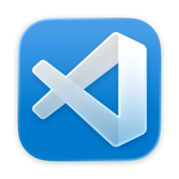
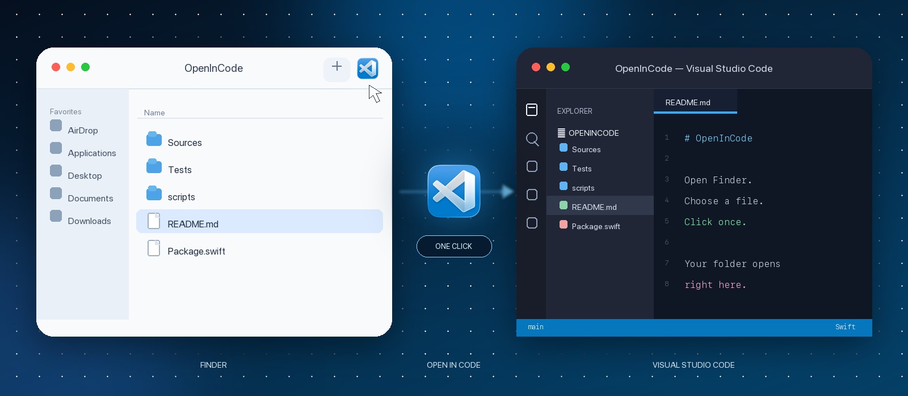

<p align="center">
  
</p>

<h1 align="center">Open in Code</h1>

<p align="center">
  Open the folder you are viewing in Finder—or the folder containing a selected item—in Visual Studio Code with one click.
</p>

<p align="center">
  <a href="https://github.com/sozercan/OpenInCode/releases/latest"></a>
  
  <a href="LICENSE"></a>
</p>

<p align="center">
  <a href="#install">Install</a> ·
  <a href="#add-it-to-finder">Set up</a> ·
  <a href="#how-it-works">How it works</a> ·
  <a href="CONTRIBUTING.md">Contribute</a>
</p>

<p align="center">
  
</p>

Open in Code is a small, native macOS utility built for the Finder toolbar. It gets you from the file you are looking at to the matching VS Code workspace without opening a terminal or navigating to the folder again.

| **One click** | **Finder-aware** | **Stable or Insiders** |
| --- | --- | --- |
| Lives in the Finder toolbar, ready whenever you need it. | Uses your selection when available and the current Finder window when it is not. | Prefers Visual Studio Code and falls back to Visual Studio Code Insiders. |

## Requirements

- macOS 12 or newer
- Visual Studio Code or Visual Studio Code Insiders

## Install

### Homebrew

```sh
brew install --cask sozercan/repo/open-in-code
```

### Direct download

Download the app from [GitHub Releases](https://github.com/sozercan/OpenInCode/releases), then move **Open in Code.app** to `/Applications`.

## Add it to Finder

1. Open `/Applications` in Finder.
2. Hold <kbd>⌘ Command</kbd> and drag **Open in Code** to the Finder toolbar.
3. Drop it wherever you want the button to live.

Hold <kbd>⌘ Command</kbd> while dragging the button again to reposition or remove it.

## How it works

Open a Finder window, optionally select an item, and click **Open in Code**.

| Finder state | What opens in VS Code |
| --- | --- |
| A folder is selected | The selected folder |
| A file or Finder package is selected | Its containing folder |
| Multiple items are selected | The first selected item's folder |
| Nothing is selected | The folder shown in the front Finder window |

## Finder permission

> [!NOTE]
> On first use, macOS asks whether **Open in Code** may control Finder. Allow access so the app can read the current Finder selection.

<details>
<summary><strong>If Finder access was previously denied</strong></summary>

Enable **Open in Code → Finder** in the appropriate settings pane:

- **macOS 13 or newer:** System Settings → Privacy & Security → Automation
- **macOS 12:** System Preferences → Security & Privacy → Privacy → Automation

</details>

## Contributing

Source builds, tests, packaging, and release instructions live in [CONTRIBUTING.md](CONTRIBUTING.md).

---

<p align="center"><sub>Made for macOS · Licensed under the <a href="LICENSE">MIT License</a></sub></p>
